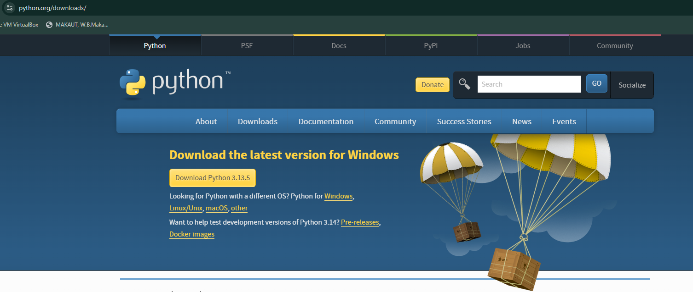

# Python: From Beginner to Developer

<div align="center">
  
  <br>
  <p><em>Your complete guide to becoming a Python Developer</em></p>
</div>

## 🎯 What's Inside?

- 📚 **Structured Learning Path**: From basics to advanced concepts
- 💻 **Hands-on Projects**: Real-world applications to build your portfolio
- 🎯 **Interview Preparation**: Common questions and solutions
- 🚀 **Code Examples**: Practical implementations for every concept

## 📚 Learning Path

1. **Basics**

   - Python Installation & Setup
   - Variables & Data Types
   - Control Structures
   - Functions & Modules

2. **Intermediate**

   - Object-Oriented Programming
   - File Handling
   - Error Handling
   - Working with APIs

3. **Advanced**
   - Web Development
   - Database Integration
   - Testing & Debugging
   - Performance Optimization

## 💻 Projects

- Basic Calculator
- To-Do List Application
- Weather App
- File Management System
- More coming soon...

## 🎯 Interview Preparation

- Common Python Interview Questions
- Data Structure Problems
- Algorithm Solutions
- Best Practices & Tips

## 🚀 Getting Started

1. Clone this repository:

   ```bash
   git clone https://github.com/yourusername/python-beginner-to-developer.git
   ```

2. Navigate to the project:

   ```bash
   cd python-beginner-to-developer
   ```

3. Start with the basics in the `1_basics` directory

## 📝 How to Use This Repository

1. Follow the numbered directories in order
2. Read the markdown files for theory
3. Try the code examples
4. Complete the exercises
5. Build the projects

## 🤝 Contributing

Contributions are welcome! Feel free to:

- Add more projects
- Improve existing code
- Add interview questions
- Fix bugs

<div align="center">
  <sub>Built with ❤️ for Python learners</sub>
</div>
